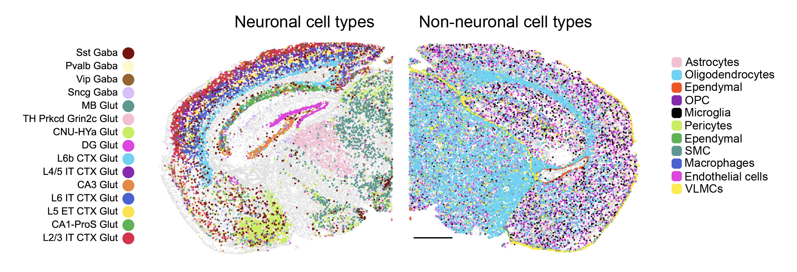

<h1 align="center"> Transcriptional circuitry underlying neuropathology-associated microglia phenotypes </h1>
## Molecular signatures and spatial organisation of AD-pathology-associated microglia under different conditions

## Description:
## In this repository, we show how to analyze MERFISH (MERSCOPE/VIZGEN) datasets on  the brain samples of AD-pathology mouse models. Additionally, we provide our data processing pipelines to reproduce the figures for our submitted 2024 manuscript.

## Abstract
The development of Alzheimer’s disease (AD) is driven by the progressive accumulation of amyloid- (A), hyperphosphorylated tau, and eventually synaptic loss and neurodegeneration. These features, alongside other factors such as myelin changes, are sensed by microglia, resulting in the acquisition of distinct microglia phenotypes proposed to have protective or pathogenic consequences1-4. Altering these phenotypes for therapeutic purposes is a major goal, however, this objective is limited by a lack of understanding of the mechanisms that link the detection of neuropathology to specific transcriptional outcomes. Here, we address this problem by defining the gene expression profiles, spatial locations and open chromatin landscapes in the context of A or tau/APOE4-induced pathology.  

## Spatial Data Download

The data needed to reproduce our results is available for download [here](http://zenodo).

## Processing
We have a spatial processing pipeline with segmentation and processing Jupyter notebooks to create the adata objects needed for figure creation.

Processing of AD-pathology mouse model MERSCOPE data.
   [MERSCOPE processing](/processing_pipeline)

## Figures

This section contains the scripts to reproduce the figures in the paper.

### MERFISH Figure Script Links

| Figure | Link                                                  |
|--------|-------------------------------------------------------|
| Global Brain Clustering (Fig1a & ExtendFig1)     | [Notebook](/figure_scripts/Fig1a_ExtFig1.ipynb) |
| Microglia Clustering and spatial (Fig1b-e & ExtendFig2a-b )   | [Notebook](/figure_scripts/Fig1b-e_ExtFig2a-b.ipynb) |
| Microglia densities in brain regions    | [Notebook](/figure_scripts/ExtFig2c-d.ipynb) |
| Microglia Pathology Trajectory    | [Notebook](/figure_scripts/Fig1f_ExtFig2e-f.ipynb) |

## Contact

- Yi (Joy) Zhou: :envelope: yiz592@ucsd.edu
